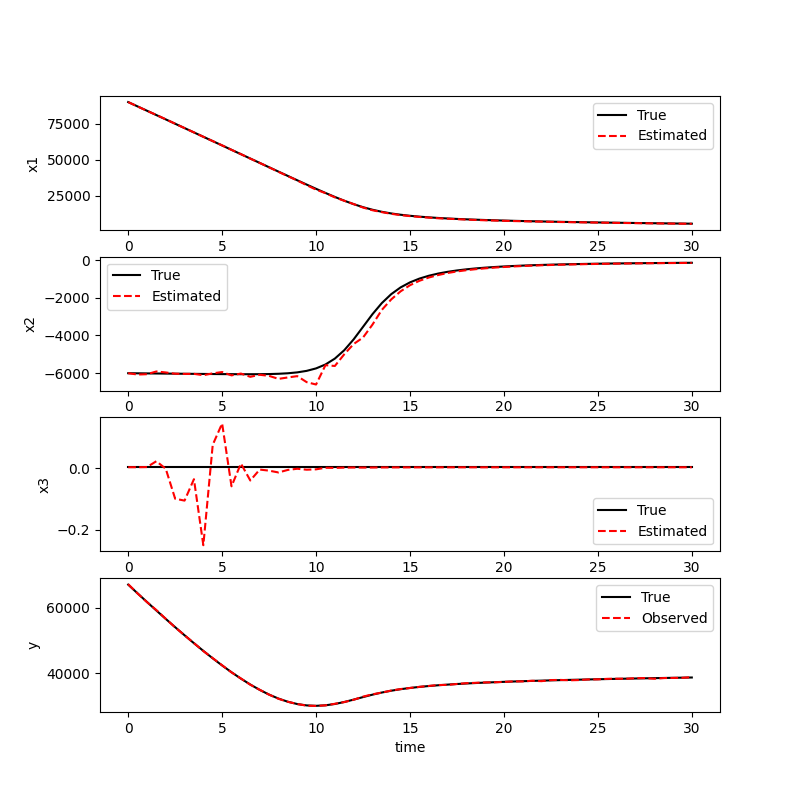

# Rustによる拡張U-D分解フィルタの実装

## U-D分解フィルタとは

U-D分解フィルタ[1]は、カルマンフィルタの数値的安定性を改善するために考案されたアルゴリズムである。

計算結果は代数的には通常のカルマンフィルタと同じである。誤差共分散行列の計算をU-D分解した状態で行うことで、数値計算の誤差により対称性や非負正定値性が崩れることを防いでいる。

このプログラムは，上述したU-D分解フィルタを非線形に拡張したものである．といっても，カルマンフィルタと拡張カルマンフィルタが殆ど同じ式であるように，線形のU-D分解フィルタからの変更点はごく一部である．

## 問題設定

参考文献[2]のpp.174-182の例題と同じ．

## 実行結果

## 参考文献

[1] 片山 徹，”応用カルマンフィルタ”，朝倉書店, 1983.

[2] 足立修一，丸太一郎，”カルマンフィルタの基礎”，東京電機大学出版局，2012．
